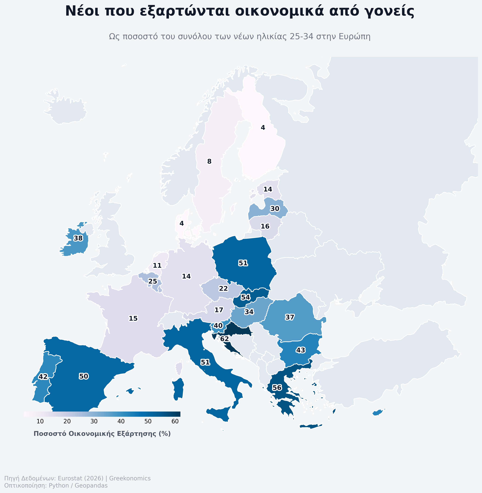

# 🇪🇺 European Youth Economic Dependency (25-34)

A data visualization project analyzing the economic dependency of young adults across the European Union, utilizing institutional mapping standards (EPSG:3035 projection). 

## 📌 Project Overview
This project processes raw Eurostat data to generate a high-quality, publication-ready choropleth map. The visualization highlights the percentage of young adults (aged 25-34) who remain economically dependent on their parents across different EU member states.

## 🛠️ Technical Stack & Methodology
* **Python**: Core scripting language for data manipulation and visualization.
* **Geopandas & Matplotlib**: Used for spatial data processing, rendering polygons, and applying the `PuBu` color scale.
* **Cartographic Standards**: Implemented the **Lambert Azimuthal Equal Area (EPSG:3035)** projection, which is the official standard used by the European Commission and Eurostat for statistical mapping.
* **Data Processing**: Calculated representative point centroids to ensure accurate static data label placement on complex landmass geometries.

## 📂 Repository Structure
* `euro_dependence_2026.py`: The main Python script handling the spatial joins, projection conversions, and map rendering.
* `euro_dependency_2026.csv`: The cleaned dataset containing the countries and their respective percentages.
* `eurostat_data.json`: Supplementary geospatial boundary/metadata.
* `final_eurostat_navy_map.png`: The final high-resolution exported visualization.

## 📈 Key Insights
The visualization reveals a stark North-South divide within Europe regarding youth economic independence. Scandinavian countries display single-digit dependency rates, whereas Southern European and Balkan nations exhibit rates exceeding 50%, highlighting significant structural and macroeconomic disparities.